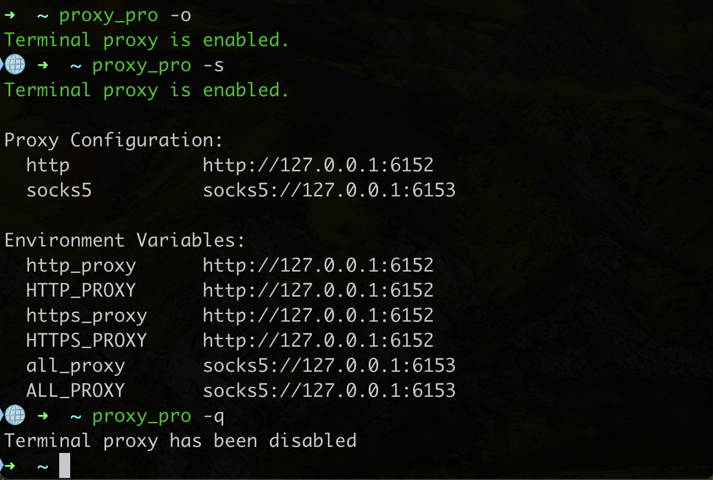

# 🌐 zsh-proxy-pro

An oh-my-zsh plugin for managing and displaying proxy status.



## Installation

Clone this repository into the `oh-my-zsh` plugins directory:

```shell
git clone https://github.com/vv314/zsh-proxy-pro.git $ZSH_CUSTOM/plugins/zsh-proxy-pro
```

Add `zsh-proxy-pro` to your [plugins array](<(https://github.com/ohmyzsh/ohmyzsh/blob/master/templates/zshrc.zsh-template#L73)>) in your `zshrc` file:

```zsh
plugins=(... zsh-proxy-pro)
```

## Usage

```zsh
proxy_pro [OPTION] [ARGUMENT]
```

**Options:**

```zsh
-o  enable the proxy
-c  configure proxy
-q  quit the proxy
-s  show the proxy status
-h  show the help
```

### Configure proxy

Usage: `proxy_pro -c <http | socks5> <host:port>`

Examples:

```zsh
# Set http proxy
proxy_pro -c http 127.0.0.1:6152

# Set socks5 proxy
proxy_pro -c socks5 127.0.0.1:6153
```

### Enable proxy

```zsh
proxy_pro -o
```

### Disable proxy

```zsh
proxy_pro -q
```

### Print status

```zsh
proxy_pro -s
```

Outputs:

```
Terminal proxy is enabled.

Proxy Configuration:
  http              http://127.0.0.1:6152
  socks5            socks5://127.0.0.1:6153

Environment Variables:
  http_proxy        http://127.0.0.1:6152
  HTTP_PROXY        http://127.0.0.1:6152
  https_proxy       http://127.0.0.1:6152
  HTTPS_PROXY       http://127.0.0.1:6152
  all_proxy         socks5://127.0.0.1:6153
  ALL_PROXY         socks5://127.0.0.1:6153
```

### Customize Prompt

When the proxy is enabled, a prompt symbol `🌐` will be displayed.

You can customize the icon using `PROXY_PROMPT_SYMBOL`.

`~/.zshrc`：

```zsh
export PROXY_PROMPT_SYMBOL="🔐"
```

## Uninstallation

Remove the `zsh-proxy-pro` item from the plugins array.

Remove `zsh-proxy-pro` from disk:

```zsh
rm -rf $ZSH_CUSTOM/plugins/zsh-proxy-pro ~/.zsh-proxy-pro
```
